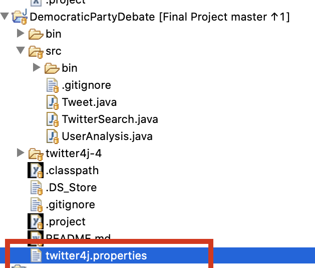
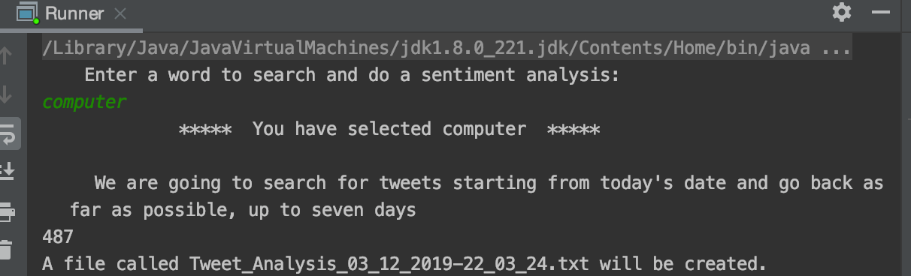
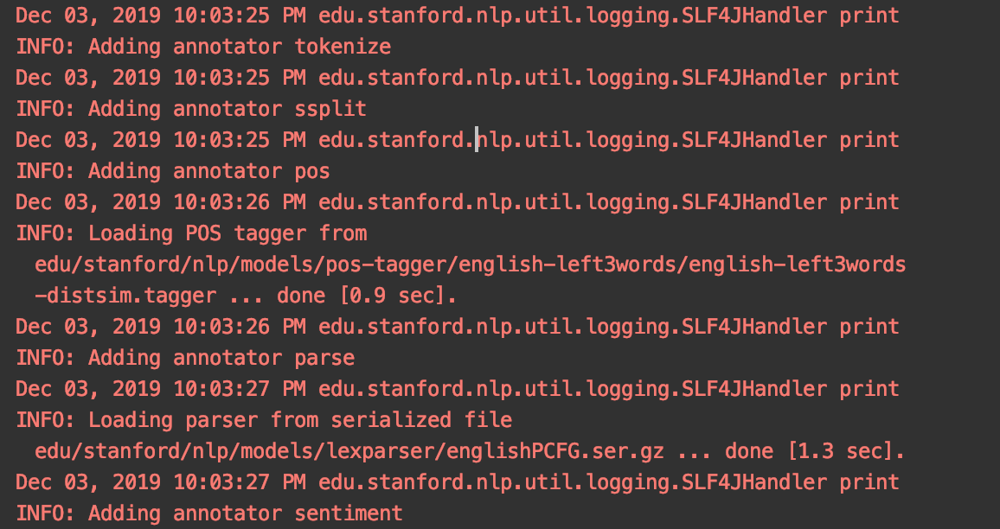
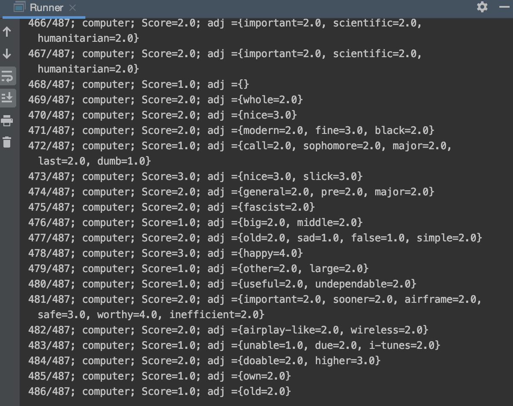
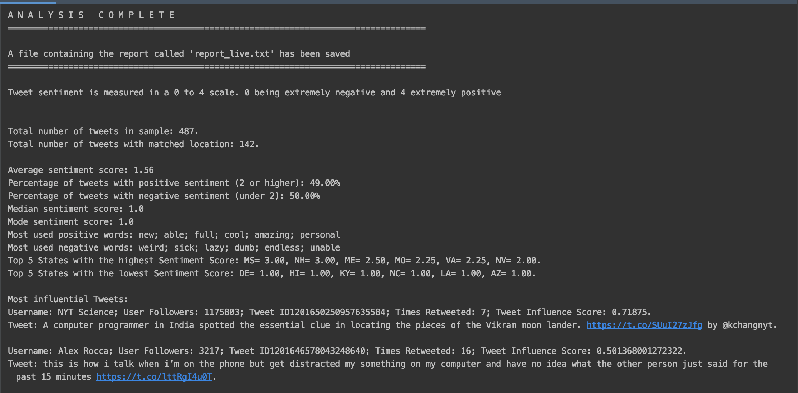
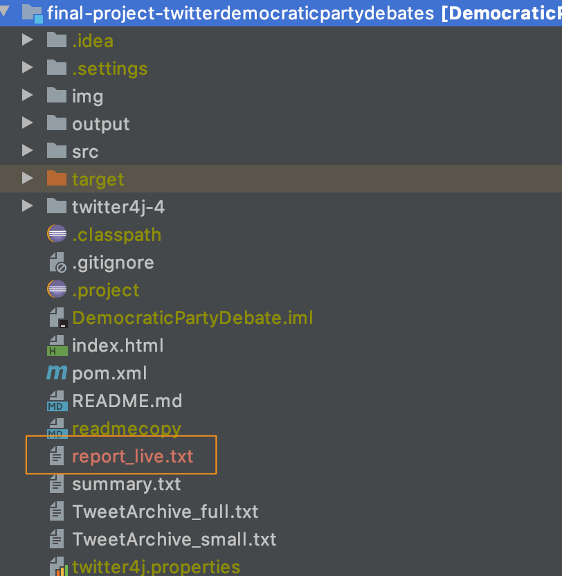
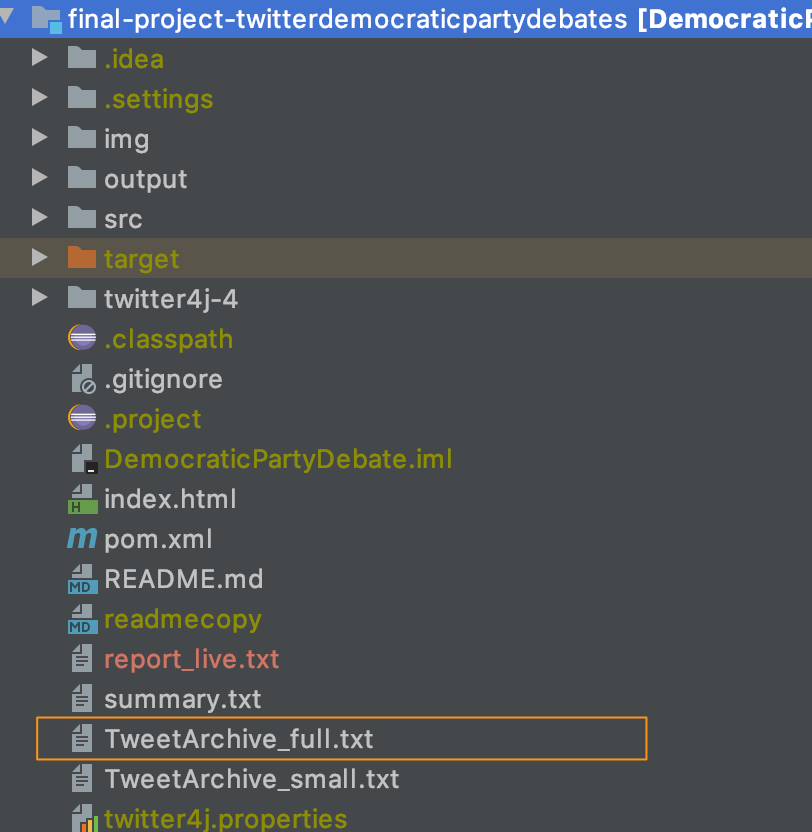
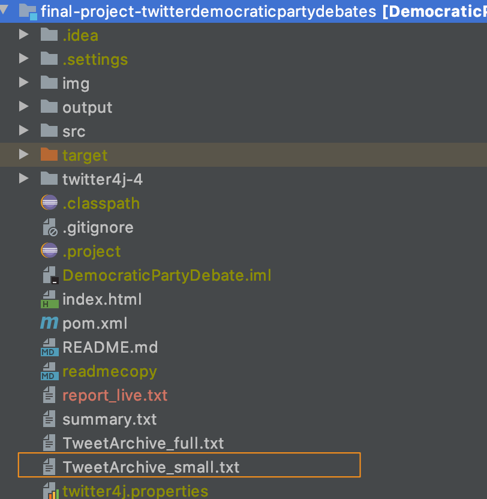
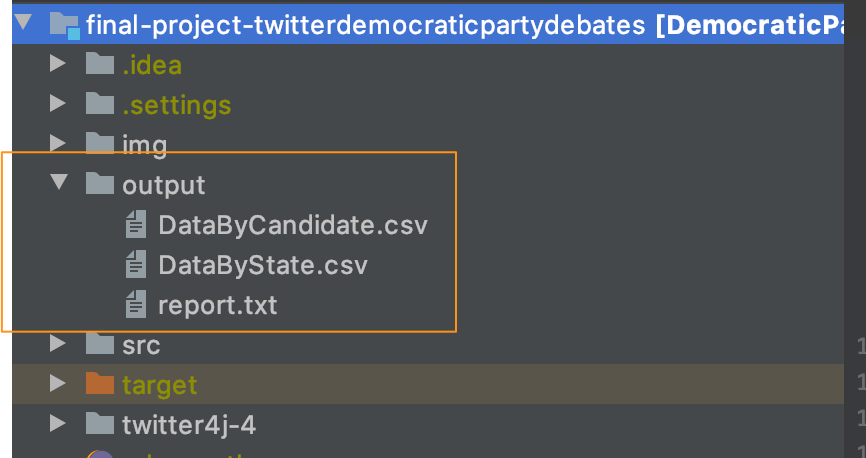
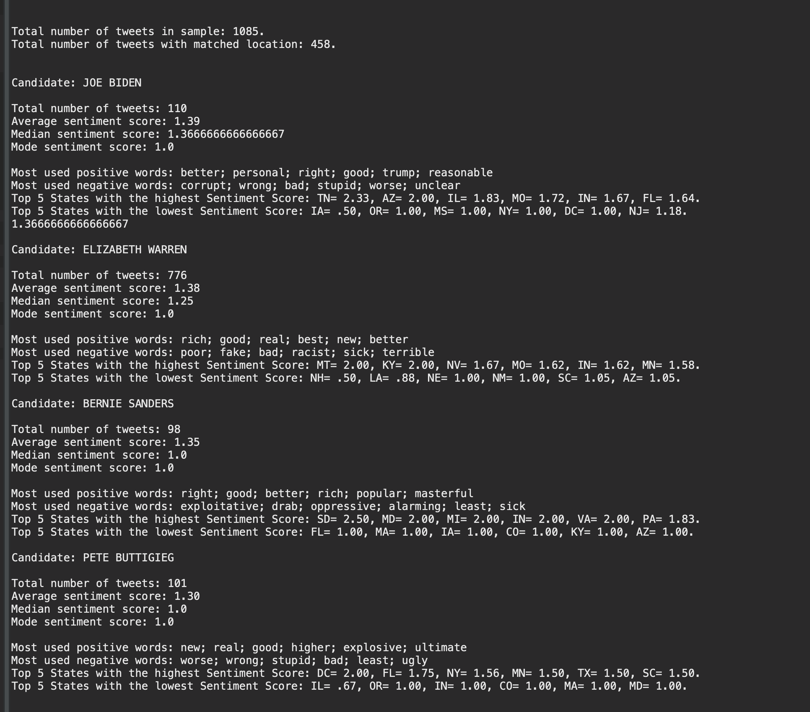

# final-project-twitterdemocraticpartydebates
final-project-twitterdemocraticpartydebates created by GitHub Classroom
591 Final Project Design

Project landing page: https://upenn-cit599.github.io/final-project-twitterdemocraticpartydebates/

### Team members 

Joanne Crean [ [creanj@seas.upenn.edu](mailto:creanj@seas.upenn.edu) ]

Juan Goleniowski [ [juangole@seas.upenn.edu](mailto:juangole@seas.upenn.edu) ]

Federica Pelzel [ [fpelzel@seas.upenn.edu](mailto:fpelzel@seas.upenn.edu) ]

### Project Idea
Perform a sentiment analysis on tweets mentioning a user-specified keyword. 

The user can decide what keyword they are interested in and the program will query Twitter to get relevant tweets, analyze these and then output the analysis results in the console. The analysis of tweets mentioning this keyword gives the average sentiment, most common positive and negative adjectives, and the states that have the lowest and highest average sentiment.

After some research, the Stanford CoreNLP toolkit was chosen for the sentiment analysis as it's freely available, could analyse short blocks of text, and uses a deep learning model that took whole sentences into account as opposed to assessing words individually. The sentiment score ranges from 0 - 4. Scores: 0 = very negative, 1= negative, 2 = neutral, 3 = positive, 4 = very positive.

A static analysis was also done to analyze tweets mentioning Democratic candidates around the 5th Democratic debate of November 20th. This was to demonstrate the capacity of the program. A website was build to display the results: https://upenn-cit599.github.io/final-project-twitterdemocraticpartydebates/

### Set-up the program
* You will need a Maven plugin in your IDE to build the project. 
  * For Eclipse: 
    * Install the plugin: m2eclipse
    * Convert the project to be a Maven project
* The Runner class contains the main method for running the program in real-time.
* The DemDebate class was used to run the static analysis on previously collected tweets around the DemDebate on Nov 20th.
* Dependencies:
  * Twitter4j library: You need to create a developer account and store a twitter4j.properties file in the main project         folder.
  
  * Standford CoreNLP API: No credentials needed to use.
  * Emoji Java library: No credentials needed to use
  * These libraries will be automatically imported when the project is run. 
  
### Real-time running of the program
1. Open the **Runner class** and run the main method. 
2. User input (**UserInteraction class**)
    1. User asked to enter keyword to search for.
    2. User told when the search begins.
    
3. Query for keyword (**TwitterSearch class**)
    1. Queries Twitter for Tweets mentioning the key-word, starting on today's date.
    2. Query limited to tweets in English.
    3. User will get up to 100 search results in every search. The number of searches that can be excuted is controlled by value in MAXSEARCHREQUESTS. Twitter allows up to 180 searches every 15 minutes.
    4. Analysis starts with today's tweets and then keeps scanning back over the last 7 days until it's reached the query limit. 
4. Store Tweets to text file.(**SaveTweets class**). The search result is stored in a file with a time stamped file name: Tweet\_Analysis\_dd\_MM\_yyyy-HH\_mm\_ss.
5. Additionally, it creates a Tweet object for each Tweet from the results(**Tweet class**); the following variables are stored:
    1. Tweet ID
    2. User who created the tweet
    3. Number of followers that the user has
    4. User location as entered by the user
    5. Tweet text
    6. Tweeter creation date
    7. Search term used
    8. A zero to be populated by the influence score later
    9. Retweet count
    10. If the tweet is a retweet
    11. Geolocation from gps if available
6. Add tweets to an ArrayList.
7. Influence score is calculated for each Tweet and added to the Tweet object.(**InfluenceScore class**)
   1. Calculation based on the num of followers and number of retweets that the tweet had  
8. Pre-process each tweet's text for sentiment analysis: (**TweetProcessor class**)
    1. Remove urls, hashtags, user mentions, underscores, hyphens, quotation marks, non-ascii characters
    2. Replace emojis with their text equivalent (Emoji Java library)
9. Get sentiment for tweet using Stanford CoreNlP (**NLPAnalyser class**)
    1. Prepare tweet for analysis: 
       1. Tokenise: break down the tweet into words.
       2. Ssplit: divide into sentences.
       2. Point-of-speech tag: tag each type of word, e.g. verb, noun.
       3. Parse: figure out the grammatical structure of the sentence.
    2. Get sentiment score for prepared tweet
    3. Add sentiment score to Tweet object
    
10. Get the adjectives in the tweet, alongside their sentiment score and store in a HashMap.(**NLPAnalyser class**)
    1. Add to the tweet object
11. Analyser pulls in ArrayList of tweets to answer questions:(**DataAnalysis class**)
    1. What is the average sentiment for the tweets mentioning the keyword?
    2. What is the mode sentiment for the tweets mentioning the keyword?
    3. What is the median sentiment for the tweets mentioning the keyword?
    4. What percentage of tweets were negative and what percentage were positive? 
    5. What are the most used positive adjectives in tweets mentioning the keyword?
    6. What are the most used negative adjectives in tweets mentioning the keyword?
    7. Which are the 5 states with the highest sentiment score?
    8. Which are the 5 states with the lowest sentiment score?
    9. Total number of tweets mentioning the keyword that were analysed?
12. As the program runs the tweets, their sentiment scores and the adjectives found are listed. This gives the user an insight into the analysis as it's happening.
   
12. Output results:(**DataAnalysis class**)
    1. Display in console
      
    2. Text file of tweets
      

### Static analysis around Nov 20th debate
1. The static analysis was done on tweets gathered from Nov 13 - Nov 20th and Nov 22nd - 30th
   1. Batches of tweets were collected and added to a TweetArchive.txt file.	
      
   2. To test, run the **DemDebate class** and when prompted to type a filename type "TweetArchive_small.txt". This is a          smaller file with a sample of around 500 tweets that allows for a reduced analysis.
      
2. The **DemDebate class** takes in a text file of tweets and runs debate specific analysis from it.   
   1. Takes in file and parses each row into a Tweet object.  		
3. ArrayList of tweets is created for each candidate. 
4. Tweets are analysed for sentiment and given influence score, sentiment score and adjectives, as described under the real-      time running section, steps 5-10.
5. Tweet location is analyzed using natural language sorting and stored into state ArrayLists.(**TweetsByState class**)
6. Analysis is run at the candidate level include state analysis.(**DataAnalysis class**)
8. For the analysis, the following questions were answered for each candidate:
   1. Total number of tweets
   2. Number of tweets with matched location
   3. What is the average sentiment of the tweets for this candidate?
   4. What percent of tweets have a positive sentiment, or negative sentiment?
   5. What is the median sentiment of the tweets for this candidate?
   6. What is the mode sentiment of the tweets for this candidate?
   7. What are the most used positive adjectives in tweets mentioning the candidate on this date?
   8. What are the most used negative adjectives in tweets mentioning the candidates on this date?
   9. Which are the 5 states with the highest sentiment score on this date?
   10. Which are the 5 states with the lowest sentiment score on this date?
9. Output results:
   1. Output folder:
      1. DataByStates.csv
      2. DataByCandidate.csv
      3. report.txt (a txt report with the console output)
       
   3. Static analysis in console.
        
   4. Website: https://upenn-cit599.github.io/final-project-twitterdemocraticpartydebates/

### Classes
* Tweet 
* UserInteraction
* TwitterSearch 
* SaveTweets
* InfluenceScore 
* TweetProcessor
* NLPAnalyser 
* DataAnalysis 
* Runner
* TweetsByState
* DemDebate

### Limitations
* We are using a free Twitter account so: 
  * The Twitter API will only give data for the last seven days. 
  * The Twitter API will only return 100 tweets for a search. 
  * The Twitter API will only allow 180 searches every 15 minutes.
* Stanford CoreNLP API was trained on movie reviews so may not be as accurate for Tweets. 
* Tweets often have slang and misspellings that cannot be reliably analyzed.

### Future improvements
* Visual representation of results in real-time.
* Train our own NLP model on Tweets to get more accurate results.
* Use a paid Twitter account to get more data back for analysis.
* Expand the analysis.

### References 
1. Stanford CoreNLP API: https://stanfordnlp.github.io/CoreNLP/index.html
2. [https://towardsdatascience.com/sentiment-analysis-for-text-with-deep-learning-2f0a0c6472b5]
3. Twitter4j API: http://twitter4j.org/en/
4. Emoji java library :https://github.com/vdurmont/emoji-java

